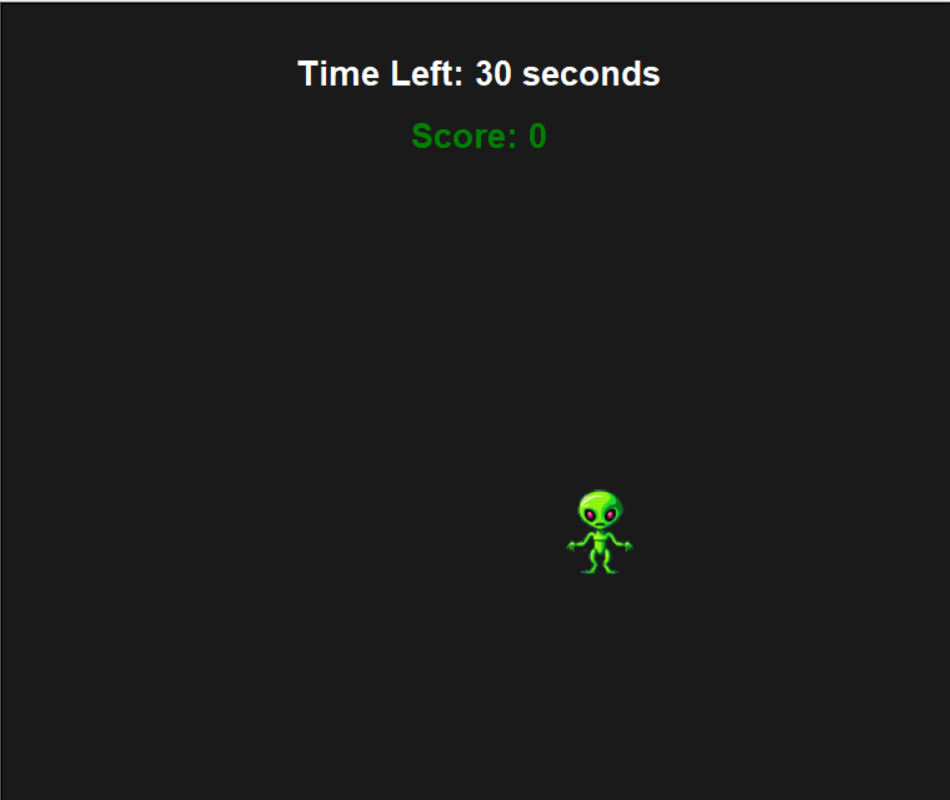
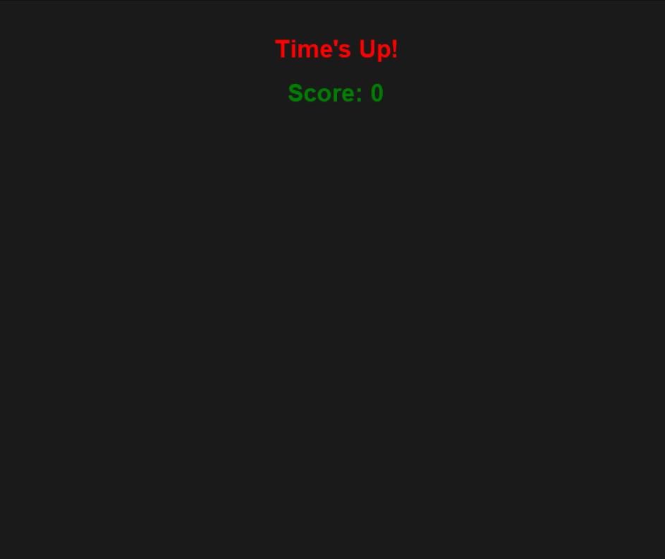

# Catch the Alien

Welcome to **Catch the Alien**, a fun and interactive game built with Python's Turtle module. Test your reflexes by catching the alien before time runs out and aim for the highest score!

---

## Features
- **Dynamic Gameplay:** The alien moves to random positions on the screen.
- **Timer Countdown:** You have 30 seconds to catch as many aliens as you can.
- **Score Tracking:** Keep track of your performance with an on-screen score display.
- **User Interaction:** Click on the alien to score points.
- **Game Over Screen:** Displays a message when the time runs out.

---

## How to Play
1. Clone this repository or download the project files.
2. Make sure you have Python installed on your system.
3. Run the `catch_the_alien_game.py` file.
4. Click on the alien as it moves to random positions.
5. Earn points for each successful click before the timer runs out.

---

## Installation
1. Clone the repository:
   ```bash
   git clone https://github.com/sddmr/catch-the-alien_game.git
   ```

2. Navigate to the project folder:
   ```bash
   cd catch-the-alien
   ```

3. Install any required dependencies (if applicable).

4. Run the game:
   ```bash
   python catch_the_alien.py
   ```

---

## Screenshots

### Gameplay


### Game Over



---

## Code Overview
The game is built using the **Turtle** module and includes the following components:
- **Dynamic Timer:** A countdown timer that updates every second.
- **Random Movement:** The alien moves to random positions on the screen.
- **Click Interaction:** Detects user clicks to increase the score.

### Key Functions
- `countdown(saniye)`: Manages the countdown timer.
- `move_hero()`: Moves the alien to a random position.
- `on_hero_click(x, y)`: Updates the score when the alien is clicked.

---

## Contributing
Feel free to fork this repository and submit pull requests for any enhancements or bug fixes. Suggestions for new features are always welcome!

---

## License
This project is licensed under the MIT License. See the LICENSE file for details.

---

Enjoy the game and happy coding!

